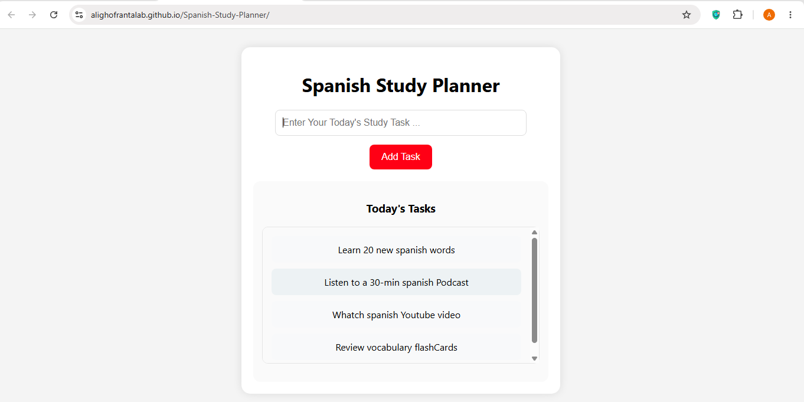

# Spanish Study Planner

A simple and interactive JavaScript project for organizing daily Spanish learning tasks.

This project was built as a beginner-friendly exercise to practice HTML, CSS, and JavaScript fundamentals while creating a useful productivity tool for language learners.

## 🚀 Live Demo

https://alighofrantalab.github.io/Spanish-Study-Planner/

## ✨ Features

- ➕ Add new study tasks
- ⌨️ Press Enter to add tasks quickly
- 📋 Scroll-able task list
- 🎨 Clean and minimal UI design
- 📚 Focused on Spanish learning organization

## 🛠️ Built With

- HTML5
- CSS3
- Vanilla JavaScript (ES6)

## 📚 What I Learned

- DOM manipulation
- Event handling (click and keyboard events)
- Creating elements dynamically with JavaScript
- Working with user input
- Building a simple task management interface
- Structuring a small front-end project

## 📸 Preview

## ## 🧭 Version History

### v1.0

- Initial release
- Add Task functionality
- Enter key support
- Scrollable task container
- Basic UI design

### v1.1 (Planned)

- Complete Task feature
- Delete Task feature
- Task Counters (Total, Completed, Remaining)

### v1.2 (Planned)

- Local Storage support
- Dark Mode

### v2.0 (Planned)

- Complete UI redesign
- Progress Bar
- Statistics Dashboard
- Professional task management interface

## 📌 Future Improvements

- Complete tasks with one click
- Delete tasks
- Task statistics and counter
- Local storage support
- Dark mode 🌙
- Study categories (Vocabulary, Grammar, Listening, Speaking)
- Daily learning goals

## 👨‍💻 Author

Ali Ghofrantalab

GitHub: https://github.com/AliGhofrantalab

Project created for learning and portfolio purposes.

## ⚠️ Note

This is a beginner project created for learning JavaScript and building a GitHub portfolio.
